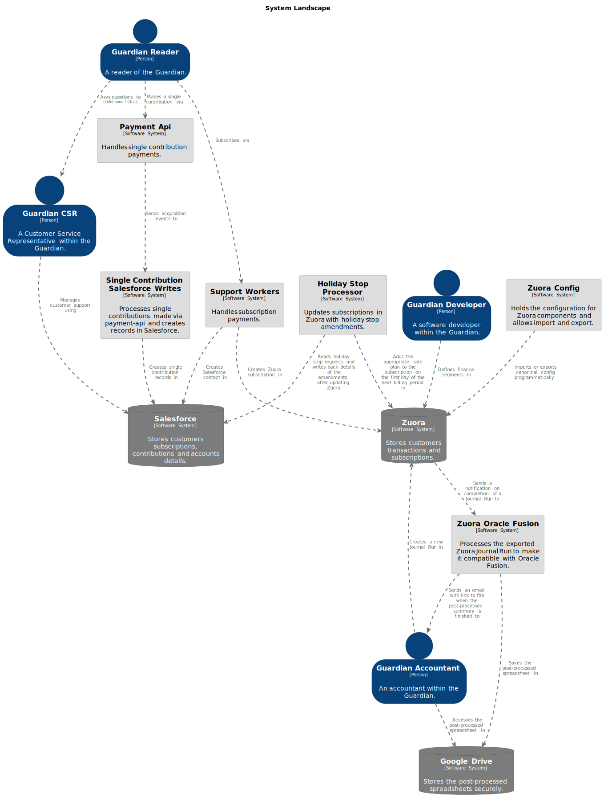

# C4 Model Architecture Diagrams Of The Guardian

In this experiment, the goal is to use the Strcturizr DSL language to create C4 model as code for the whole P&E department.

If you would like to take part, please get in touch.

